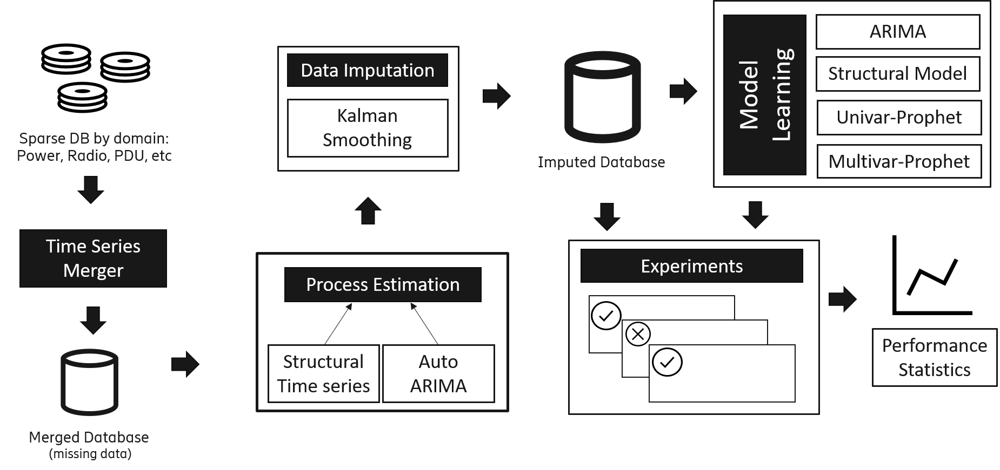

# Reduction of Power Supply Units hardware alarms in Radio Base Stations using Machine Learning

Public repository for the thesis work I developed at Ericsson Research for my Statistics and Machine Learning master thesis during January-June 2021. 

The figure below sumarises the overall pipeline implemented. 

For questions and further research, do not hesitate on writing at `agustin.valencia@ericsson.com`

### Acknowledgement

It is based in the template files in [this repo](https://gitlab.liu.se/olale55/liuthesis) which is opened to all LiU students. For privacy I haven't forked it, so I give the proper ackowledgement.
